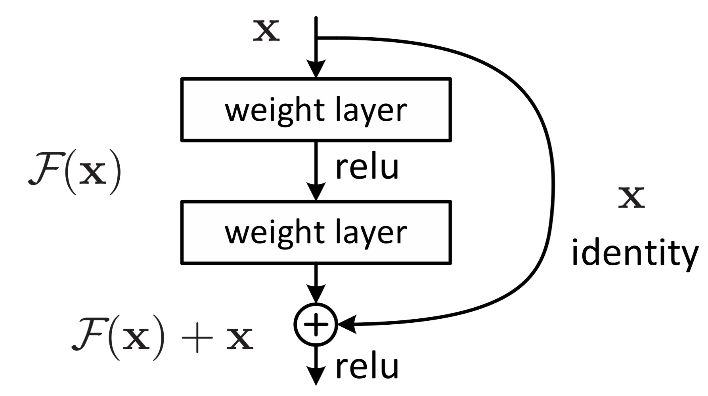
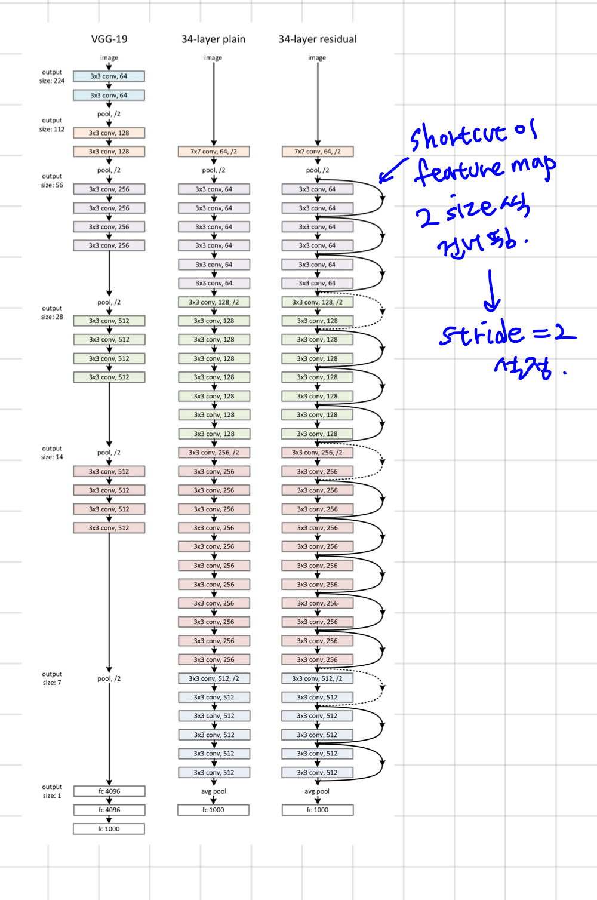

# Deep Residual Learning for Image Recognition

## Abstract

- Residual learning framework → To ease the training of networks
- 신경망을 깊게 쌓으면 성능이 좋아질줄 알았는데, 오히려 기울기 소실 문제 → Identity Mapping
- ILSVRC 대회 결과 → depth 매우 중요한 요소!
- but depth 올라감 → Overfitting, Vanishing Gradient, 연산량 증가 등 문제
- ResNet → ImageNet, CIFAR-10 모두에서 훌륭한 성능 보임. ensemble 했을때, 오차 3.75%까지 줄임

*Residual Learning: 이전 layer의 결과를 다시 이용하는 것 → residual function 사용

*Identity Mapping: 입력을 그대로 출력으로 내보내는 변환 $f(x) = x$

학습 도중 layer가 쓸모 없다고 판단되면, $F(x)$를 0으로 만들어 버리면 됨. → $H(x) = 0 + x$

“복잡하게 요리해서 망칠 바에, 그냥 원재료를 내보내는게 낫다”

## 1. Introduction

- 깊은 모델에 더 많은 layer 추가? → train 오류 올라감
- 심층 신경망 → 성능이 최고수준에 도달할 때 정확도 급격히 떨어짐 → degradation 문제 (Overfitting 문제가 아니라, 네트워크가 너무 깊어져서 학습 자체가 안되는 ‘퇴보’문제
- 해결방법?
    - 추가된 레이어 → identity mapping layer
    - 추가되지 않은 레이어 → 더 얕은 모델에서 학습된 layer 사용
- 잔차학습 구조: $H(x) - x$ 얻는 것이 목표.

- Residual Function: $F(x) = H(x) - x$ 최소화 하는 것 → (출력 - 입력) 차이 줄임.             $F(x) = 0 , H(x) = x$ 이 최적의 해 ⇒ $H(x)$를 $x$ 로 mapping 하는 것이 학습의 목표

* ResNet의 Shortcut Connection은 미분을 했을 때 항상 '1'이라는 상수를 남김 → 그래디언트가 소실되지 않고 입력층까지 직통으로 전달되게 함

기존 네트워크는 역전파 때 가중치들을 계속 곱하면서(chain rule) 내려오는데,  1보다 작은 수를 계속 곱하면 0이 되어버림

하지만 ResNet은 $H(x) = F(x) + x$ 구조라서, 이걸 미분하면 $F'(x) + 1$이 됨.
역전파 수식을 전개해보면, 상위 층의 에러 신호가 가중치 층($F$)을 거치는 경로와, Shortcut($1$)을 타는 경로 두 갈래로 더해져서 ****내려오게 됨

즉, 가중치 층에서 그래디언트가 소실되더라도, Shortcut 경로(Identity)가 '1'로 버티고 있어서 에러 신호가 입력층까지 살아서 도착! 

## 2. Related Work

1. **Resiual Representations**
    
    Vector Quantization(벡터 양자화) → Residual Vector Encoding(효과적!) > Original Vector Encoding
    
    *벡터 양자화: feature vector X → (mapping)→ class vector Y
    
    편미분 방정식 풀기 위해 Multigrid Method 대신 Hierarchical Basis Pre-conditioning 사용
    
    *Multigrid Method: System을 여러 하위 문제로 재구성 하는것, 각 하위문제는 더 큰 Scale, 더 작은 Scale간의 residual 담당
    
    ⇒ 합리적인 문제 재구성, 전제조건은 최적화를 더 간단하게 수행해준다는 것 의미
    
2. **Shortcut Connections**
    
    parameter 추가x, 0으로 수렴x
    
    identity shortcuts → 닫히지 않고 모든 정보들 통과됨. 지속적으로 residual function 학습 가능
    

## 3. Deep Residual Learning

### 3.1. Residual Learning

- 실제로는 Identity Mapping이 최적일 가능성 낮음. but ResNet에서 제안하는 재구성방식 → 문제에 Pre-condition 추가하는 데 도움을 줌
- Pre-conditioning으로 인해 Optimal function이 Zero Mapping 보다 Identity mapping에 더 가깝다면, solver가 Identity Mapping을 참조하여 작은 변화를 학습하는 것이 새로운 function을 학습하는 것보다 더 쉬울것

### 3.2. Identity Mapping by Shortcuts

$y=F(x, {W_i}) + W_sx$

- $W_s$ : 차원을 매칭 시켜줄때만 사용(linear projection), 더하기 연산이 성립하려면, $F(x)$ 와 $x$의 행렬 크기가 같아야 한다.

### 3.3. Network Architectures - ImageNet 용 2가지 모델

1. **Plain Network**: VGG Nets에서 영감 받음, Shortcut Connection X, 전통적인 방식의 깊은 신경망
- 2가지 규칙 기반 설계
    1. Output feature map의 size가 같은 layer들은 모두 같은 수의 conv filter 사용
    2. Output feature map의 size가 반으로 줄어들면 time complexity를 동일하게 유지하기 위해 filter수 2배로 늘림

- Downsampling을 수행한다면 stride가 2인 conv filter 사용한다 → 메인 경로에서 이미 이미지 크기 반으로 줄임. Shortcut ($x$) 의 크기도 반으로 줄여야 더할수있게됨

* 왜 Pooling을 안쓰는지? 정보를 요약하는 방법까지도 모델이 스스로 학습하게 하기 위해서

*  Downsampling: Max Pooling(가장 큰 숫자 빼고 다 버림) / Strided Convolution(가중치 이용해서 이 구역의 정보를 가장 잘 요약하는 값으로 계산, image 크기 줄이면서도, 어떤 정보를 남길지 파라미터 ($w$)가 직접 학습) 

1. **Residual Network**: Plain Model 기반, Shortcut Connection을 추가하여 구성
- input, output 차원이 같다면? → 바로 Identity Shortcut 사용
- Dimension이 증가했다면? → 1) Zero Padding 적용, 차원 키워줌 2) Projection Shortcut 사용 (1x1 conv)

### 3.4. Implementation 모델 구현

1. Shorter size가 [256, 480] 사이가 되도록 random하게 resize 수행
2. horizontal flip 부분적 적용, per-pixel mean 빼줌
3. 224x224 사이즈로 random하게 crop 수행
4. Standard color augmentation 적용
5. Batch Normalization 적용
6. 가중치 초기화
7. Optimizer: SGD (mini batch size:256)
8. learning rate: 0.1 에서 시작, 학습이 정체될때 10씩 나눠줌
9. weight decay: 0.0001
10. Momentum: 0.9
11. 60x10^4 반복수행 (iteration)
12. dropout 미사용

→ 이후 test 단계: 10-crop testing, multiple scale 적용, shorter side가 {224, 256, 384, 480, 640} 중 하나가 되도록 resize, 평균 score 산출

### 4. Experiments

4.1. Image Net Classification

- 모델 구조

!image.png

1. **Plain Networks**
    
    18 layer plain 모델 비해 34 layer 모델이 더 높은 validation error 나타남
    
    → vanishing gradient때문은 아니라고 판단
    

!image.png

1. **Residual Networks**
    
    1) residual learning → 34-layer ResNet이 18-layer ResNet보다 2.8% 가량 우수한 성능 보임
    
    2) 34-layer ResNet 의 top1 error 3.5%가량 줄어듦 → Residual learning이 extremely deep system에서 매우 효과적!
    
    3) 18-layer ResNet, Plain Net 성능 거의 유사, but 18-layer ResNet 더 빨리 수렴
    

!image.png

1. **Identity vs Projection Shortcuts**: 2 options
    
    (A) zero-padding shortcut 사용한 경우, 이때 모든 shortcut은 parameter-free 하다.
    
    (B) projection shortcut 사용한 경우, 다른 모든 shortcut은 identity하다. (차원이 증가하는 경우에만 사용)
    
    (C) 모든 shortcut으로 projection shortcut 사용한 경우
    
    → 3가지 옵션 모두 plain model 보다 좋은 성능 보임
    
    (A) < (B) < (C)
    
    but 3가지의 성능 차이는 미미함 → projection shortcut이 문제를 해결하는데 필수적이지 x
    
    Q. Shortcut Connection은 차원이 다를때 어떻게 연결하는가? (레이어를 지나면서 채널수가 변하면?)
    
    A. option (A), (B) 사용 → **zero padding**(부족한 채널만큼 0으로 채워 넣음, 정보가 늘어나진 않는다), **projection shortcut**(1x1 Convolution을 사용하여 $x$의 차원을 $F(x)$와 강제로 맞춤. 이 방식이 성능이 더 좋다고함)
    
    → 차원이 다를떄는 1x1 Conv로 맞춰서 더한다~
    

1. **Deeper Bottleneck Architectures**
    
    ImageNet에 대하여 학습을 진행할 때 building block을 bottleneck design으로 수정
    
    !image.png
    
    Q. ResNet-18, 34는 3x3 conv 두 개를 쓰는데, ResNet-50 이상부터는 왜 1x1, 3x3, 1x1 구조를 쓸까?   
    
    A. 연산량을 줄이기 위해!
    
    **Bottleneck 구조:** 먼저 **1x1 Conv**로 채널 수를 확 줄이고(압축), **3x3 Conv**로 연산을 수행한 뒤, 다시 **1x1 Conv**로 채널 수를 원래대로 늘림, 이렇게 하면 파라미터 수를 줄이면서도 성능 저하 없이 깊은 층(50층 이상)을 쌓을 수 있다
    
2. 50-layer ResNet: 34-layer ResNet의 2-layer Block → 3-layer bottleneck block 대체. (B)옵션 사용 
3. 101-layer and 152-layer ResNets: 3-layer ResNets: 3-layer Block 사용하여 152-layer ResNets 구성. depth가 상당히 증가하였음에도 낮은 복잡성. degradation 문제 x, 높은 정확도  

4.2. CIFAR-10 and Analysis

Image Net 말고도 CIFAR-10 대상으로 모델을 학습 및 검증

- Analysis of Layer Responses: ResNet의 response가 Plain Net보다 상대적으로 많이 낮게 나옴 → Residual function이 non-Residual function보다 일반적으로 0에 가까울 것
- Exploring over 1000 layers: 1000개 이상 layer가 사용된 모델 → 110-layer ResNet과 training error 비슷, but test 결과 안좋음 ⇒ Overfitting 때문으로 판단
